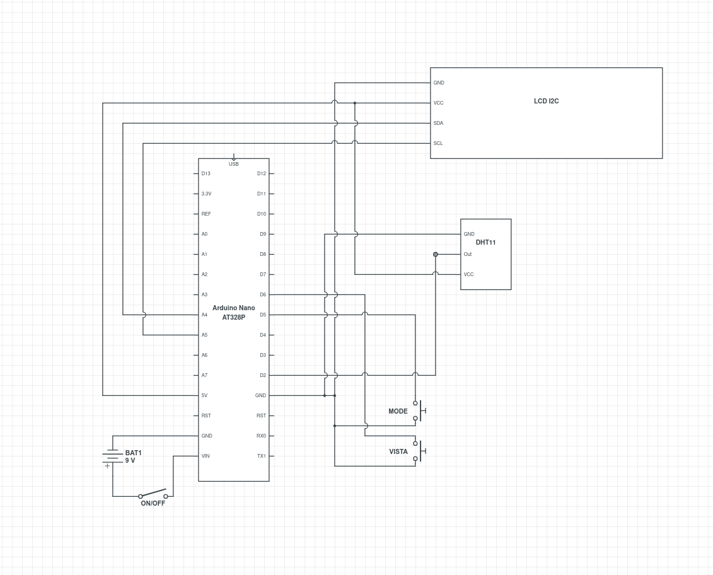

# 🚴‍♂️ TriWeather-Station: El Recomanador de Roba Esportiva

Un dispositiu basat en Arduino que monitoritza temperatura i humitat per recomanar l'equipament òptim per a **Ciclisme** i **Running**. 

Dissenyat com a regal d'Amic Invisible per a un triatleta.

## 📋 Funcionalitats
* **Doble Mode:** Diferents recomanacions per a córrer (genera més calor) i bici (el vent refreda).
* **Sensor en temps real:** Utilitza un DHT11 per llegir l'ambient.
* **Interfície intuïtiva:** Pantalla LCD 16x2 amb botons per canviar de mode i vista.
* **Avisos visuals:** Presentació de modes i mesures.

## 🛠️ Materials (Bill of Materials)
* Arduino Nano (ATmega328P)
* Sensor DHT11
* Pantalla LCD I2C 16x2
* 2x Polsadors
* Caixa impresa en 3D (PLA)

## 🔌 Esquema de Connexió



## 🚀 Instal·lació i Càrrega del Codi

Aquest projecte utilitza **Arduino CLI** per a la compilació i càrrega, tot i que també es pot obrir amb l'IDE d'Arduino clàssic.

### 1. Requisits Previs
Assegura't de tenir `arduino-cli` instal·lat i el nucli AVR configurat:

```bash
# Actualitzar l'índex i instal·lar el suport per a Arduino Nano
arduino-cli core update-index
arduino-cli core install arduino:avr
```

### 2. Instal·lació de Llibreries

El projecte depèn de les següents llibreries externes. Executa aquestes comandes per instal·lar-les automàticament:

#### Llibreria per a la pantalla LCD

```bash
arduino-cli lib install "LiquidCrystal I2C"
```

#### Llibreria per al sensor DHT11
```bash
arduino-cli lib install "DHT sensor library"
arduino-cli lib install "Adafruit Unified Sensor"
```

### 3. Compilar i Pujar

Connecta l'Arduino al port USB (sol ser `/dev/ttyUSB0` o `/dev/ttyACM0`).

>Nota: La majoria de clons d'Arduino Nano utilitzen el "Old Bootloader". Si tens un Nano original, elimina la part `:cpu=atmega328old`.


#### Compilar i pujar en un sol pas

```bash
arduino-cli compile --upload -b arduino:avr:nano:cpu=atmega328old -p /dev/ttyUSB0 src/main.ino
```
Solució de problemes:

>Si tens error de permisos al port USB: `sudo chmod a+rw /dev/ttyUSB0`

>Si dona error de sincronització (programmer is not responding), prova a treure `:cpu=atmega328old` de la comanda.

